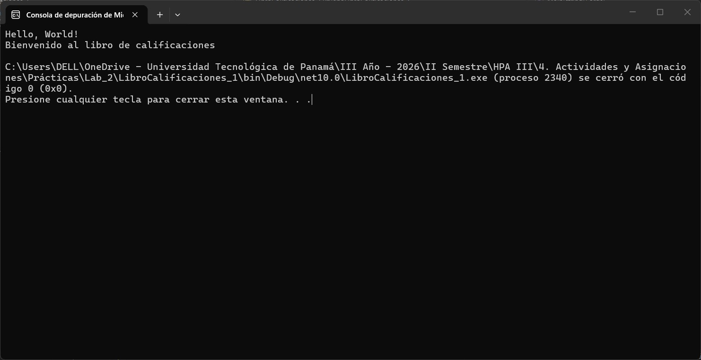
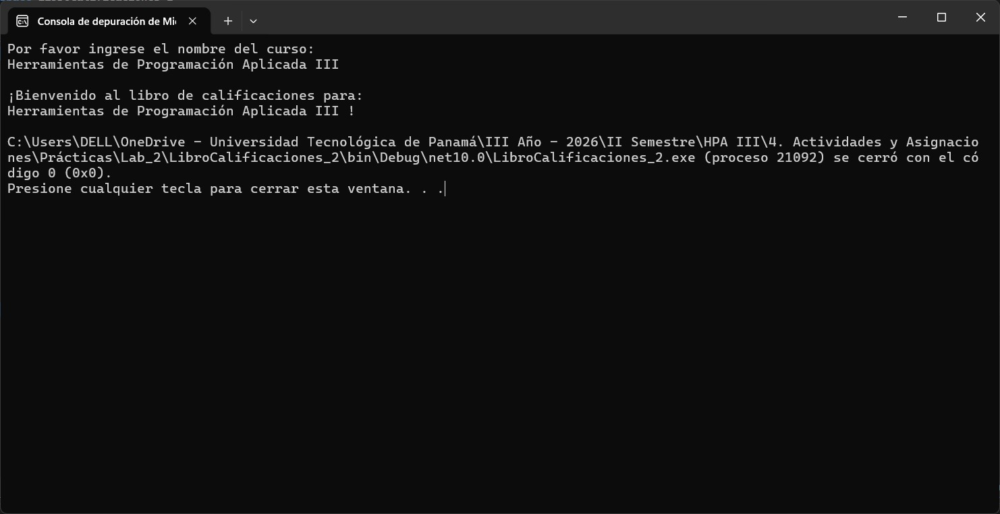
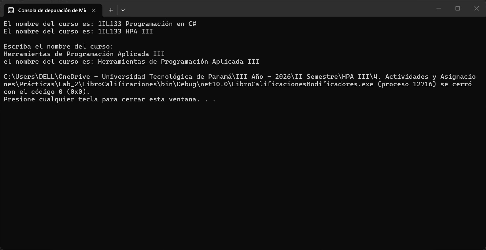

# Laboratorio #2 - Modelado de Clases y Gestión de Atributos mediante Propiedades en C#
**Fecha:** 31/08/2026

---

## Contenido del Repositorio
Este laboratorio abarca el diseño, modelado e implementación de clases en C# bajo el paradigma de la Programación Orientada a Objetos (POO) en .NET. Se aborda la organización de programas por consola, el funcionamiento del método `Main` como punto de entrada, el uso de modificadores de acceso (`public` y `private`), el paso de parámetros a métodos, y la aplicación del encapsulamiento a través de variables de instancia privadas con propiedades `get` y `set`[cite: 1].

---

## Tecnologías Utilizadas
* **Lenguaje / Framework:** C# / .NET 10.0 (Aplicaciones de Consola)
* **Base de datos:** N/A (Manejo de datos en memoria mediante objetos)
* **Herramientas:** Visual Studio 2026, Git, GitHub[cite: 1, 3]

---

## Capturas de Pantalla y Problemas

### Interfaz Principal

[cite: 3]
[cite: 3]
[cite: 3]

* **Actividad 1 (Creación de Clases e Instanciación Básica):** Implementación de la clase `LibroCalificacion` con un método público `MostrarMensaje()`[cite: 1, 3]. Se demuestra el proceso de instanciación con el operador `new` y la invocación de métodos sin parámetros[cite: 1].
* **Actividad 2 (Declaración de Métodos con Parámetros):** Desarrollo de la clase `MiLibroCalificaciones` que incluye un método `MostrarMensaje(string nombreCurso)`[cite: 1, 3]. Captura datos mediante `Console.ReadLine()` y aplica marcadores de posición `{0}` para la salida por consola[cite: 1].
* **Actividad 3 (Variables de Instancia y Propiedades `get`/`set`):** Implementación del encapsulamiento en la clase `LibroCalificaciones`[cite: 1, 3]. Se define una variable de instancia `private string nombreCurso`, un constructor explícito y una propiedad pública `NombreCurso` con descriptores `get` y `set` para la lectura y modificación controlada del estado del objeto[cite: 1].

---

## Estructura de Carpetas o Directorios

```plaintext
Laboratorio2/
├── README.md                           # Documentación principal del repositorio
├── Laboratorio2.sln                    # Archivo de solución de Visual Studio[cite: 1]
├── LibroCalificaciones/                # Proyecto Actividad 3[cite: 1]
│   ├── LibroCalificaciones.csproj
│   ├── Program.cs                      # Punto de entrada Main[cite: 1]
│   └── LibroCalificacion.cs            # Clase LibroCalificacion[cite: 1]
├── LibroCalificaciones_1/              # Proyecto Actividad 1[cite: 1]
│   ├── LibroCalificaciones_1.csproj
│   ├── Program.cs                      # Lectura de consola e interacción[cite: 1]
│   └── MiLibroCalificaciones.cs        # Clase con método parametrizado[cite: 1]
└── LibroCalificaciones_2/              # Proyecto Actividad 2[cite: 1]
    ├── LibroCalificaciones_2.csproj
    ├── Program.cs                      # Prueba de propiedades y constructor[cite: 1]
    └── LibroCalificaciones.cs          # Clase encapsulada con get/set[cite: 1]
```

---

## Instrucciones de Ejecución / Uso

1. **Clonar el repositorio:**
   ```bash
   git clone [https://github.com/jacu2006/Laboratorio2.git](https://github.com/jacu2006/Laboratorio2.git)
   cd Laboratorio2-HPA3

---

## Autor y Contexto
* **Nombre:** Javier Alberto Acuña Castro[cite: 3]
* **Institución:** Universidad Tecnológica de Panamá (UTP)[cite: 1, 3]
* **Facultad:** Facultad de Ingeniería de Sistemas Computacionales (FISC)[cite: 1]
* **Curso:** Herramientas de Programación Aplicada III (.NET) - Grupo 1IL133[cite: 1]
* **Instructor:** Ing. Irina Fong[cite: 1]
* **Fecha de Realización:** 31/08/2026[cite: 1, 3]

---

## Referencias
* Guía de laboratorio: *Modelado de Clases y Gestión de Atributos mediante Propiedades en C#* - Ing. Irina Fong[cite: 1, 3].
* Guía de Estandarización de Repositorios y Documentación con Markdown - FISC UTP[cite: 2, 3].
* [Documentación oficial de C# y .NET (Microsoft Learn)](https://learn.microsoft.com/es-es/dotnet/csharp/)[cite: 3]
